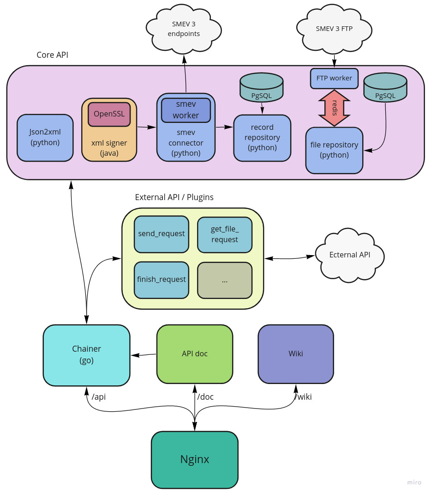

# Architecture

The architecture of the application is modular. Each module is atomic, almost independent of the others and can be used separately from the application as a separate component.

All application modules have similar input and output data and interact with each other using REST api and JSON requests.

All application modules can be divided into 2 categories: `core` and `additional`.

All `core` modules create the **core API**. The core API defines the basic operations from SMEV 3 such as: *sending messages, receiving a response from the message queue, tracking message statuses, data conversion, file operations, data signing and etc*.

`External` modules can work on top or in parallel with the base modules by calling their functions or using any other external functionality. 

All `core` modules are delivered out of the box with the application, while external modules can either be supplemented by the users themselves or delivered as a set. The user is free to use any framework and programming language to develop `external` modules.

All `external` and `core` modules interact with the user through api gateway called `chainer`. 

`Chainer` is a very important part of the whole system. It allows you to configure the logic of interaction between services by combining and validating data. He also collects logs and statistics about each service. If an `external` service wants to call any function from the `core` service, it must do this through a `chainer`.

In addition to the API, there are still some elements of the web user interface such as **this wiki** and **API documentation**. These components are not parts of the API; therefore, they are taken out of it.

Below is a diagram describing all the services and how they interact:

