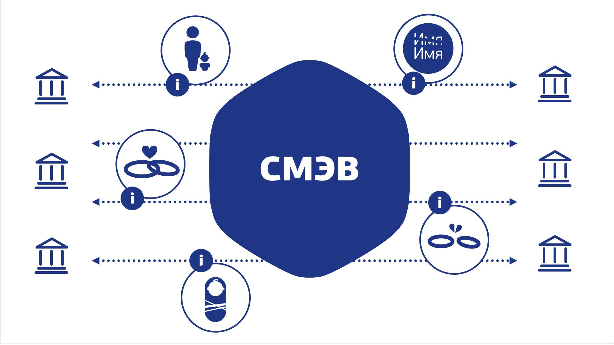

# Smev 3 client

Smev 3 client is a set of APIs and libraries for working with [smev 3.X](https://smev3.gosuslugi.ru/portal/). The application supports schemes for working with SMEV versions 1.1, 1.2, 1.3.

The project is inspired by such features 🚀:

- RESTfull API
- Microservices and atomic functions
- Easy to deploy and use
- JSON bsed API
- Lightweight and multi-threading application
- Easy to configure and scale
- Plugins and Extensions
- Transaction transparency
- Mutable behavior

The application is a constructor that provides the basic blocks and operations of interaction with SMEV 3. Each operation has similar input and output parameters so that it is easy to build query chains and pipelines of interaction with SMEV 3.

Application writes with Open Source components: `Python 3`, `Fast API`, `uvicorn`, `lxml`, `zeep`, `Go`, `Gin`, `Krackend`, `Java (open jdk)`, `Spark`, `OpenSSL`, `GOST Engine`, `Spark`, `PgSQL`.

### Useful links and manuals

- [Official web page](https://smev.gosuslugi.ru/portal/)

- [Official documentation](https://smev3.gosuslugi.ru/portal/api/files/2_%D0%9C%D0%B5%D1%82%D0%BE%D0%B4%D0%B8%D1%87%D0%B5%D1%81%D0%BA%D0%B8%D0%B5%20%D1%80%D0%B5%D0%BA%D0%BE%D0%BC%D0%B5%D0%BD%D0%B4%D0%B0%D1%86%D0%B8%D0%B8%20%D0%BF%D0%BE%20%D1%80%D0%B0%D0%B1%D0%BE%D1%82%D0%B5%20%D1%81%20%D0%95%D0%A1%D0%9C%D0%AD%D0%92%20%D0%B2%D0%B5%D1%80%D1%81%D0%B8%D1%8F%20%203.4.0.1.docx)
- [Hemulen it blog](https://hemulen-it.ru/smev/)
- [Smev signature check tool](https://smev3.gosuslugi.ru/portal/checkxmlform.jsp)
- https://habr.com/ru/post/282225/
- https://habr.com/ru/post/440882/